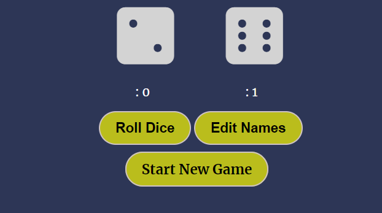
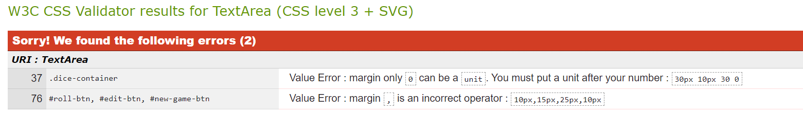
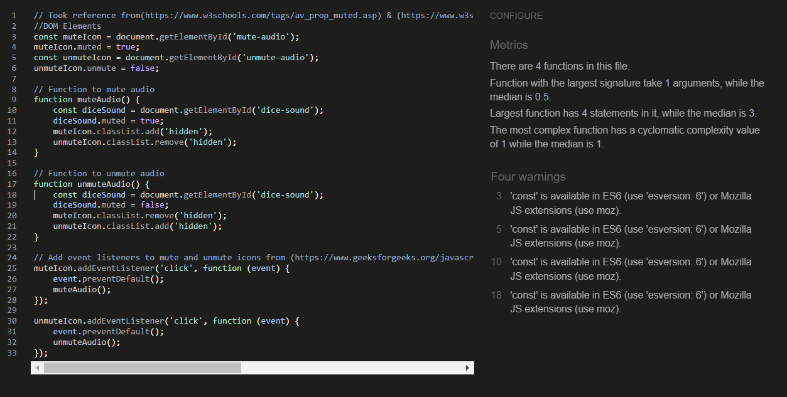
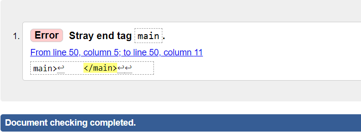
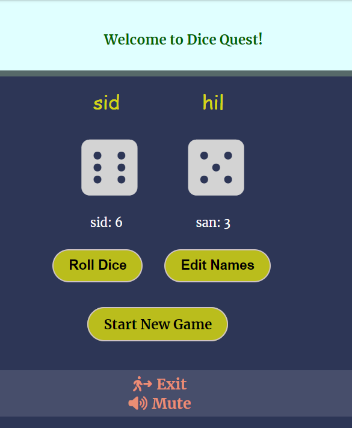
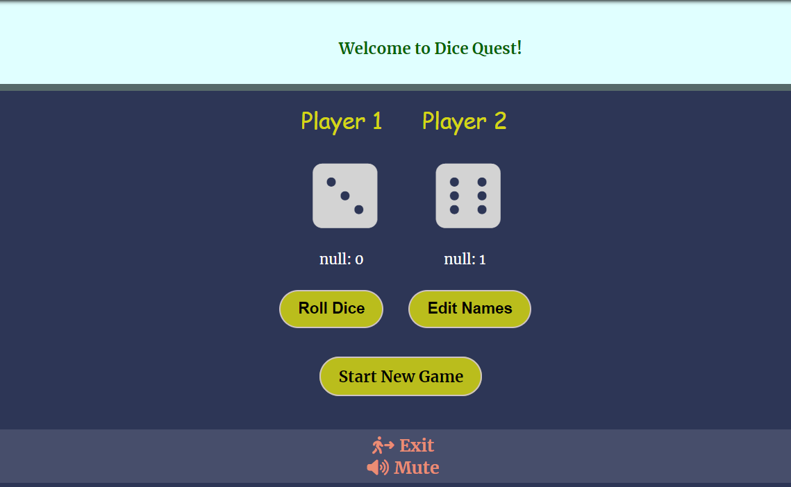

# Dice Quest

Dice games have been enjoyed for centuries, offering endless entertainment with their simple yet engaging mechanics. Roll dice game brings its own set of rules to play, making them suitable for various ages and preferences. It's a game of both luck and strategy that can be enjoyed alone or with others. Now, users/players can enjoy this timeless game virtually through my gaming webpage.

- GitHub Profile: <https://github.com/klsoundarya/dice-quest>
- Deployed Site: <https://klsoundarya.github.io/dice-quest>

## Table of contents

- [User Stories](#user-stories)
  - [First Time User Goals](#first-time-user-goals)
  - [Returning Site Users](#returning-site-users)
  - [Site Owner Goals](#site-owner-goals)
  - [Target Audience](#target-audience)
- [Wireframes](#wireframes)
  - [Mobile Wireframes](#mobile-wireframes)
  - [Laptop & Desktop Wireframes](#laptop--desktop-wireframes)
- [Deployment](#deployment)
  - [GitHub Pages](#github-pages)
  - [Forking](#forking)
  - [Making a Local Clone](#making-a-local-clone)
- [Features](#features)
  - [Existing Features](#existing-features)
  - [Features to Implement](#features-to-implement)
- [Design](#design)
  - [UX](#ux)
  - [Typography](#typography)
  - [Gallery](#gallery)
  - [Color Scheme](#color-scheme)
- [Testing](#testing)
  - [Manual Testing](#manual-testing)
  - [Validator Testing](#validator-testing)
    - [HTML](#html)
    - [CSS](#css)
  - [Bugs](#bugs)
    - [Unfixed Bugs](#unfixed-bugs)
- [Credits](#credits)
  - [Tools & Technologies Used](#tools--technologies-used)
  - [Acknowledgments](#acknowledgements)
  - [Disclaimer](#disclaimer)

### User Stories
<!-- Read few README documents of previous batches to understand user stories and wrote accordingly -->

#### First time User Goals

- As a user, I want to easily understand the rules and objective of the dice game.
- As a user, I want to seamlessly register my name and my opponent's name before starting the game.
- As a user, I want to enjoy an engaging and interactive gameplay experience with sound effects.
- As a user, I want to see my score and my opponent's score updated in real-time as we play.
- As a user, I want to receive clear notifications for each round's result and the overall game winner.
- As a user, I want the game interface to be intuitive and easy to navigate.
- As a user, I want the game to automatically reset scores and rounds after a game ends, so I can start a new game effortlessly.
- As a user, I want the game to work smoothly across various devices and screen sizes.

#### Returning Site Users

- As a returning user, I want to see my previous scores and game history so that I can track my progress.
- As a returning user, I want to be able to easily pick up where I left off, continuing from my last saved game state.
- As a returning user, I want to find new game challenges, modes, or updates since my last visit to keep the gameplay fresh and engaging.
- As a returning user, I want to be notified of any new features, updates, or bug fixes that have been added to the game.
- As a returning user, I want to engage with other players by viewing leaderboards, participating in discussions, or sharing my scores on social media.
- As a returning user, I want to customize my player profile or avatar to personalize my gaming experience.
- As a returning user, I want to access any new tips, strategies, or tutorials that can help me improve my gameplay.
- As a returning user, I want to be reminded of the rules and objectives of the game, especially if there have been any changes or updates.
- As a returning user, I want to receive rewards or bonuses for my continued engagement with the game, such as achievements or in-game currency.

#### Site Owner Goals

- As a site owner, I want to create an engaging and enjoyable experience for users by providing a well-designed and interactive dice game that captures their interest and keeps them returning to play.
- As a site owner, I want to ensure that the game accurately tracks and displays player scores, rounds, and winners, providing a fair and transparent gaming experience.
- As a site owner, I want the game to perform smoothly across various devices and screen sizes, ensuring that all users can enjoy the game without technical issues or delays.
- As a site owner, I want the game's interface to be intuitive and easy to navigate, allowing players to understand and play the game without confusion.
- As a site owner, I want to keep the game updated with new features, improvements, and bug fixes to maintain user interest and ensure the game remains functional and enjoyable.
- As a site owner, I want to provide clear and concise instructions and rules for the game, ensuring that all players understand how to play and what to expect.

### Target Audience

The Dice Roll game is designed for casual gamers and anyone looking for a fun, interactive experience. It appeals to individuals who enjoy simple, luck-based games that are easy to understand and play. This game is suitable for a wide age range, from children to adults, making it a great choice for family entertainment or a quick, enjoyable pastime. The game's simplicity and quick gameplay make it accessible to those looking for a relaxing diversion or a brief break from their daily routine.

### Wireframes

I have used [Canva](https://www.canva.com/) to design my website wireframes for mobile, laptop and desktop screen sizes to see and work on my website designing.

### Mobile Wireframes
<!-- learnt the dropdown from https://dev.to/asyraf/how-to-add-dropdown-in-markdown-o78 -->

Mobile Wireframes

 

### Laptop & Desktop Wireframes

Laptop & Desktop Wireframes

 

## Deployment

### GitHub Pages

The project was deployed to GitHub Pages using the following steps...

 

1. Log in to GitHub and locate [dice-quest repository](https://github.com/klsoundarya/dice-quest)
2. At the top of the Repository, locate the "Settings" Button on the menu.
3. Scroll down to "GitHub Pages" Section in Settings page.
4. Under "Source", click the dropdown called "None" and select "Master Branch".
5. The page will automatically refresh.
6. Scroll back down through the page to locate the now published site [link](https://klsoundarya.github.io/dice-quest) in the "GitHub Pages" section.

If using Gitpod, you can click below to create your own workspace using this repository.

#### Forking

By forking the GitHub Repository, we make a copy of the original repository on our GitHub account to view and/or make changes without affecting the original owner's repository.

You can fork this repository by using the following steps:

1. Log in to GitHub and locate the [dice-quest repository](https://github.com/klsoundarya/dice-quest)
2. At the top of the Repository (not top of page) just above the "Settings" Button on the menu, locate the "Fork" Button.
3. Once clicked, you should now have a copy of the original repository in your own GitHub account!

### Making a Local Clone

1. Log in to GitHub and locate the [dice-quest repository](https://github.com/klsoundarya/dice-quest)
2. Find the Code button situated above the file list and give it a click.
3. Choose your preferred cloning method — whether it's HTTPS, SSH, or GitHub and hit the copy button to copy the URL to your clipboard.
4. Launch Git Bash or Terminal.
5. Navigate to the directory where you want the cloned directory to reside.
6. In your IDE Terminal, input the following command to clone the repository:

> git clone <https://github.com/klsoundarya/dice-quest>

__Press Enter and your local clone will be created.__

## Features

Project Features

 

### Existing Features

- The animated dice quest logo text name is centered at the top of the page on all three pages (Home, Game, Exit) in all screen sizes.
- On the home page, the "Play" button is prominently displayed in the center. At the bottom of the page user can find links to our social media (LinkedIn and GitHub pages) and a home icon to return to the index/home page.
- Clicking the "Play" button takes user to the game page, here user can play dice roll game, a virtual game! This page also has buttons to mute the sound effects, exit the game, start new game, edit names, dice roll and reset the game (start over from the beginning).
- The user can easily navigate between the Home page, Game page, and Exit page without having to go back. The website automatically adjusts its layout based on the screen size to make everything easy to find.
- When links are broken users can see the 404 page not found as a display.

There are four media query breakpoints used: 425px, 680px, 768px, 1000px. This convenient feature allows users to easily access different sections of the website, making the browsing experience smoother and more efficient.

- Game Rules: There's a section explaining the rules of dice quest.
- Reset Button: A button allows players to reset the game and start over.
- Exit Button: A button allows players to exit the game.
- Visuals: The game has a background video, logo, and styled buttons.
- Player Name Input: Users can enter their names before starting the game.
- Dice Rolling: The game simulates the rolling of two dice with random outcomes.
- Score Tracking: The game tracks and displays the scores of both players.
- Game Outcome: The game declares the winner of each round and overall winner after 10 rounds.
- Sound Effects: The game includes sound effects for rolling dice.
- Responsive Design: The webpage is designed to be responsive, ensuring a good user experience across different devices and screen sizes.

## Features to Implement

- Enhanced User Interface: Improve the visual design and layout of the game for a more engaging user experience.
- Customizable Dice: Allow users to choose different dice styles or colors.
- Multiplayer Mode: Add support for more than two players, either locally or online.
- Difficulty Levels: Introduce different difficulty levels or game modes to cater to different skill levels.
- Game Statistics: Track and display statistics such as total wins, win rate, and average scores.
- Additional Sound Effects: Add more sound effects to enhance the gaming experience.
- Leaderboard: Implement a leaderboard to display high scores or achievements.
- Mobile App Integration: Develop a mobile app version of the game for a more immersive experience on smartphones and tablets.
- In the future, users will have the option to switch between a light and dark color scheme with a dark mode toggle.
- Add more dice roll games into the dice quest webpage.

### Design

## UX

User Experience

 

### Five Planes of User Experience

The five planes are like layers that designers think about when making things for people to use. It starts with big ideas and end with the actual look and feel of what users interact with.

#### The Strategy Plane

The strategy reason for my website is to create a virtual platform for gamers that showcases the excitement and challenge of the dice quest-dice roll game, allowing users to engage with and enjoy this classic game online.

#### The Scope Plane

Based on the Strategy Plane, the scope of my website includes implementing the rules of "Dice Quest," allowing players to interactively roll dice and track scores over multiple rounds, providing buttons for starting the game, changing player names, and toggling sound effects, with future features including a dark theme toggle and a comprehensive view of game rules.

#### The Structure Plane

After the scope plane was decided, it's time to create a structure for my "Dice Quest" virtual game website. The structure includes the layout of the homepage, game interface, rules section, and user interactions such as rolling dice, and controlling game settings. This ensures a clear, logical flow and user-friendly experience for the players.

#### The Skeleton Plane

Please refer to the [Wireframes](#wireframes) section.

#### The Surface Plane

[View the live site here.](https://klsoundarya.github.io/dice-quest)

Design Overview

 

#### Typography

In the header and main content sections - Merriweather and Lato fonts are used. Both fonts are imported from [Google Fonts](https://fonts.google.com/) and are specified in the body selector.

#### Gallery

- The home page, exit page and 404 page not found background video is sourced from [Canva](https://www.canva.com/).

#### Color Scheme

The color scheme chosen for this website features a balanced blend of vibrant and neutral tones. The palette includes deep shades like `#4a536c`, light and airy hues such as `#ececec` and `#fff00`, complemented by refreshing accents like `#626574` and `#d7efe7`. This combination creates a dynamic yet soothing visual experience, enhancing the overall aesthetic appeal.

## Testing

### Manual Testing

<!-- Created Table from Table generator -->

User Testing

 

| Page   | Action                                                 | Expected Behavior                                                                                                                                                                                                                                                                                                                                                                                                                | Pass/Fail |
|--------|--------------------------------------------------------|----------------------------------------------------------------------------------------------------------------------------------------------------------------------------------------------------------------------------------------------------------------------------------------------------------------------------------------------------------------------------------------------------------------------------------|-----------|
| Home   |     | After conducting manual testing, it has been verified that the home page displays a banner with a background video and a "Game Rules" button that reveals the rules of the game and a "Play" button that correctly links to the play.html page. The layout, styling, and functionality of these elements provide a positive user experience, with the page elements appearing as expected and the buttons functioning correctly. | Pass      |
| Game   |       | When a user clicks on the "Play" button from the index page, it will be directed to the "play.html" page, where the functionalities, including dice rolling, score tracking, name editing, and responsive design, work as intended, ensuring a reliable and enjoyable gameplay experience.                                                                                                                                       | Pass      |
| Exit   |       | After the game concludes, the user has the option to either restart the game by clicking on the "Start New Game" button or exit the game by clicking on the "Exit" button. Clicking on the "Exit" button redirects the user to the thank you page. All functionalities, including game restart and exit redirection, work as intended, providing a seamless user experience.                                                     | Pass      |
| Footer |  | When a user clicks on any of the social media icons or a home icon (Home, Github, LinkedIn icons), each link opens in a new tab and functions correctly, providing users with seamless access to the respective platforms and home icon will take the user back to the index page.                                                                                                                                               | Pass      |

- Dice Quest website is tested and verified with no issues in different browsers:
  
  - [Google Chrome](https://www.google.com/intl/en_in/chrome/)
  - [Mozilla Firefox](https://www.mozilla.org/en-US/firefox/)
  - [Microsoft Edge](https://www.microsoft.com/en-us/edge/welcome?form=MA13FJ)

- Dice Quest webpage is tested and verified that my website is responsive in various screen devices by using Google chrome web developer tools
  
  - Laptop
  - Tablet
  - Large screen mobile
  - Desktop

### Validator Testing

All pages passed through the Lighthouse test

- [Lighthouse test for Home Page](read-me/testing-validators/home-page.png)
- [Lighthouse test for Game Page](read-me/testing-validators/game-page.png)
- [Lighthouse test for Exit Page](read-me/testing-validators/exit-page.png)

### HTML

All pages have passed through the [W3 Markup HTML Validator](https://validator.w3.org/)

- 

### CSS

CSS stylesheet have passed through the [W3 CSS Validator](https://jigsaw.w3.org/css-validator/)

- 

### JS Hint

JSHint was used to look for errors in flap.js, dice.js and game.js. No errors found.

#### script.js

#### game.js

### Bugs

Bugs Fixed

 

| No | Bugs                                         | Solution                                                                                                                | Notes          |
|----|----------------------------------------------|-------------------------------------------------------------------------------------------------------------------------|----------------|
| 1  |  | Player/User name is not loading, I fixed it by targeting the element and using the innerHtml to add in the player name. | Fixed the bug  |
| 2  |           | Modified the units value error to fix the bug.                                                                          | Fixed the bug. |
| 3  |        | I added jshint esversion: 6 to fix the warnings in the JSHint.                                                          | Fixed the bug. |
| 4  |          | Removed the extra line of tag element.                                                                                  | Fixed the bug. |
| 5 	|  	| When the user clicks the "Edit Name" button, the player names are successfully updated, but the corresponding scores in the scoreboard area remain unchanged. To resolve this issue, I implemented a solution by calling the player scores after updating the player names. This ensures that the scoreboard names are updated in real-time, reflecting the latest changes made by the user. 	| Fixed the bug. 	|
| 6 	|         	| When a user clicks the "Cancel" button in the prompt without entering a new name, the player1Score and player2Score variables are updated to null. This causes the scoreboard to display null instead of the original names. To fix this issue, I used conditional operators to check if the user has entered a new name before updating the scoreboard.                                     	| Fixed the bug.	|

### Unfixed Bugs

There are no more bugs to be fixed.

## Credits

### Tools & Technologies Used

The following technologies were used in this overall project.

- I have used semantic [HTML](https://en.wikipedia.org/wiki/HTML5) elements appropriately, which helps the readers to understand the technologies & structure of my content.
- Added high contrast text against the background color in many places, which improves readability for users with visual impairments.
- Focus [CSS](https://en.wikipedia.org/wiki/CSS) styles are applied to interactive elements like links and buttons, making it easier for keyboard users to navigate your site.
- Used media queries and responsive design principles to ensure that website is accessible on a variety of devices, including mobile phones and tablets.
- [Favicon.io](https://favicon.io/favicon-converter/) is used to create the various favicon files for my website.
- [Font Awesome](https://fontawesome.com/) icons were used throughout my project.
- [cloud convert](https://cloudconvert.com/png-to-webp) was used to convert from PNG to webp.
- I utilized Font Joy and Google Fonts for font pairing and to visualize the look and feel of my website.
- [ChatGPT](https://chat.openai.com/), [Grammarly](https://app.grammarly.com/), [GeminiGoogle](https://gemini.google.com/app/c90bcfbefb253ced) and a [plagiarism checker](https://www.duplichecker.com/) is used to review the text, code and ensure there were no grammar or spelling mistakes.
- [Learn UI Design](https://www.learnui.design/tools/accessible-color-generator.html) [icolorpalette](https://icolorpalette.com/4a536c_ececec_e9fbff_638f91_d7efe7) and [Thunderstruck](https://paperheartdesign.com/blog/color-palette-thunderstruck) was used to identify primary colours, compliment and contrast color combination for the website's design.
- I used [Canva](https://www.canva.com/) to create the color scheme, readme images collage, used videos with graphics, favicon image, wireframes, and background video for the exit section page. Additionally, I used it to resize all images to a consistent size.
- I used [Am I Responsive](https://ui.dev/amiresponsive) design to show my webiste in various screen sizes.
- Used button audio from [Mixkit](https://mixkit.co/free-sound-effects/click/).
- I referred to resources such as [MDN](https://developer.mozilla.org/en-US/), [stack overflow](https://stackoverflow.com/), [W3Schools](https://www.w3schools.com/css/default.asp) [geeksforgeeks]((https://www.geeksforgeeks.org/how-to-preload-an-audio-in-html5/)) for assistance in understanding code in few places and finding answers to questions relevant to my website.
- [Visual Studio Code](https://code.visualstudio.com/) used as a remote code editor.
- [Gitpod](https://gitpod.io) used as a cloud-based IDE for development.
- [GitHub](https://github.com) used for secure online code storage.
- [GitHub Pages](https://pages.github.com) used for hosting the deployed front-end site.
- [Git](https://git-scm.com/) was used for version control by utilizing the command line terminal in VS code and GitPod to commit and Push to GitHub.
- My project is inspired from [code institute](https://learn.codeinstitute.net/) Love Math Walkthrough Project and I took game play reference of roll the dice (dice quest) from [geeksforgeeks](https://www.geeksforgeeks.org/building-a-dice-game-using-javascript/).

### Acknowledgements

- I want to express my gratitude to my Code Institute mentor, [Dick Vlaanderen](https://github.com/dickvla), for his invaluable support, encouragement, and feedback throughout this project.
- I would like to thank my Cohort Facilitator, [Amy](https://github.com/amylour), for her guidance and support, providing us with the relevant learning materials, and
- I personally want to thank my partner for his critique review and unwavering support, belief, and feedback.

### Disclaimer

> I Used my previous project readme as a reference to write the documentation (my previous project link is: <https://github.com/klsoundarya/Tales-from-South-India>).
