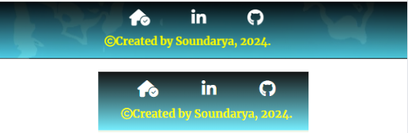

# Shut the Box

"Shut the Box" is a classic dice game traditionally played on a wooden board with tiles numbered 1 to 9 or 1 to 12. Players roll dice and flip down tiles that match the numbers they roll. The aim is to flip down all the tiles, or "shut the box," by making strategic decisions based on the dice rolls. It's a game of both luck and strategy that can be enjoyed alone or with others. Now, users/players can enjoy this timeless game virtually through my gaming webpage.

- GitHub Profile: <https://github.com/klsoundarya/shut-the-box>
- Deployed Site: <https://klsoundarya.github.io/shut-the-box/>

## Table of contents

- [User Stories](#user-stories)
  - [First Time User Goals](#first-time-user-goals)
  - [Returning Site Users](#returning-site-users)
  - [Site Owner Goals](#site-owner-goals)
  - [Target Audience](#target-audience)
- [Wireframes](#wireframes)
  - [Mobile Wireframes](#mobile-wireframes)
  - [Laptop & Desktop Wireframes](#laptop--desktop-wireframes)
- [Deployment](#deployment)
  - [GitHub Pages](#github-pages)
  - [Forking](#forking)
  - [Making a Local Clone](#making-a-local-clone)
- [Features](#features)
  - [Existing Features](#existing-features)
  - [Features to Implement](#features-to-implement)
- [Design](#design)
  - [UX](#ux)
  - [Typography](#typography)
  - [Gallery](#gallery)
  - [Color Scheme](#color-scheme)
- [Testing](#testing)
  - [Manual Testing](#manual-testing)
  - [Validator Testing](#validator-testing)
    - [HTML](#html)
    - [CSS](#css)
  - [Bugs](#bugs)
    - [Unfixed Bugs](#unfixed-bugs)
- [Credits](#credits)
  - [Tools & Technologies Used](#tools--technologies-used)
  - [Acknowledgments](#acknowledgements)
  - [Disclaimer](#disclaimer)

### User Stories
<!-- Read few README documents of previous batches to understand user stories and wrote accordingly -->

#### First time User Goals

- As a user, I want to understand the basic rules and objective of the "Shut the Box" game so I can start playing and enjoy the experience of flipping down the tiles using strategic choices based on the dice rolls.

#### Returning Site Users

- As a returning user, I want to quickly access and start playing the "Shut the Box" game.
- As a returning user, I want to continue from where I left off in my previous game session.
- As a returning user, I want to view my past scores and track my progress over time.
- As a returning user, I want to easily navigate the site and find any new updates or features added to the game.
- As a returning user, I want to engage with other users through forums and social media.
- As a returning user, I want to share my scores and achievements with friends through social media integration.

#### Site Owner Goals

- As a site owner, I want to provide users with an engaging and interactive virtual version of the "Shut the Box" game.
- As a site owner, I want to users to enjoy a digital rendition of this classic dice game, where they can roll virtual dice, press down numbered tiles, and aim to "shut the box" by using strategic choices based on the numbers rolled.
- As a site owner, I want the website to perform well, with fast loading times and efficient code, to enhance user satisfaction and engagement.
- As a site owner, I want the website to be accessible and functional across various devices and screen sizes, providing a seamless user experience for all visitors.
- As a site owner, I want this online version should replicate the fun and challenge of the traditional game while being accessible and enjoyable for both solo players and those who want to play with friends.
- As a site owner, I will regularly validate all the code to ensure compliance with web standards and best practices, reducing the risk of errors and improving overall site quality.
- As a site owner, I will proactively identify and address any bugs or issues that may arise, when maintaining the website's functionality and reliability for users.

### Target Audience

- The target audience for my "Shut the Box" game includes families, casual gamers, and individuals of all ages who enjoy strategic and luck-based games, whether playing solo or in a group.

### Wireframes

I have used [Canva](https://www.canva.com/) to design my website wireframes for mobile, laptop and desktop screen sizes to see and work on my website designing.

### Mobile Wireframes
<!-- learnt the dropdown from https://dev.to/asyraf/how-to-add-dropdown-in-markdown-o78 -->

Mobile Wireframes

 

### Laptop & Desktop Wireframes

Laptop & Desktop Wireframes

 

## Deployment

### GitHub Pages

The project was deployed to GitHub Pages using the following steps...

 

1. Log in to GitHub and locate [shut-the-box repository](https://github.com/klsoundarya/shut-the-box)
2. At the top of the Repository, locate the "Settings" Button on the menu.
3. Scroll down to "GitHub Pages" Section in Settings page.
4. Under "Source", click the dropdown called "None" and select "Master Branch".
5. The page will automatically refresh.
6. Scroll back down through the page to locate the now published site [link](https://klsoundarya.github.io/shut-the-box/) in the "GitHub Pages" section.

If using Gitpod, you can click below to create your own workspace using this repository.

#### Forking

By forking the GitHub Repository, we make a copy of the original repository on our GitHub account to view and/or make changes without affecting the original owner's repository.

You can fork this repository by using the following steps:

1. Log in to GitHub and locate the [shut-the-box repository](https://github.com/klsoundarya/shut-the-box)
2. At the top of the Repository (not top of page) just above the "Settings" Button on the menu, locate the "Fork" Button.
3. Once clicked, you should now have a copy of the original repository in your own GitHub account!

### Making a Local Clone

1. Log in to GitHub and locate the [shut-the-box repository](https://github.com/klsoundarya/shut-the-box)
2. Find the Code button situated above the file list and give it a click.
3. Choose your preferred cloning method — whether it's HTTPS, SSH, or GitHub and hit the copy button to copy the URL to your clipboard.
4. Launch Git Bash or Terminal.
5. Navigate to the directory where you want the cloned directory to reside.
6. In your IDE Terminal, input the following command to clone the repository:

> git clone <https://github.com/klsoundarya/shut-the-box>

__Press Enter and your local clone will be created.__

## Features

Project Features

 

### Existing Features

- The animated shut the box logo text name is centered at the top of the page on all three pages (Home, Game, Exit) in all screen sizes.
- On the home page, the "Play" button is prominently displayed in the center. At the bottom of the page user can find links to our social media (LinkedIn and GitHub pages) and a home icon to return to the index/home page.
- Clicking the "Play" button takes user to the game page, here user can play Shut the Box, virtual game! This page also has buttons to mute the sound effects, exit the game, and reset the game (start over from the beginning).
- The user can easily navigate between the Home page, Game page, and Exit page without having to go back. The website automatically adjusts its layout based on the screen size to make everything easy to find.

There are four media query breakpoints used: 425px, 680px, 768px, 1000px. This convenient feature allows users to easily access different sections of the website, making the browsing experience smoother and more efficient.

- Game Board: The game renders a virtual board with numbered flaps (1 to 10).
- Dice Rolling: Players can virtually roll two dice by clicking a button.
- Tile Selection: Players can click on numbered flaps to flip them down, selecting tiles that add up to the value of the rolled dice.
- Game Rules: There's a section explaining the basic rules of Shut the Box.
- Reset Button: A button allows players to reset the game and start over.
- Exit Button: A button allows players to exit the game.
- Audio: The game includes audio effects for dice rolling and flap selection (optional, can be muted).
- Visuals: The game has a background video, logo, and styled buttons.

## Features to Implement

- I will add a Multiplayer mode in the future.
- A score board to keep track of the past scores.
  - The game will automatically detect who wins and loses each round.
  - Automated roll dice function will be added.
  - To keep the competition fair with a timer that tracks how long each player takes to close all the flaps.
- In the future, users will have the option to switch between a light and dark color scheme with a dark mode toggle. This will allow user to choose the mode that's most comfortable for your eyes, especially in low-light environments or if you prefer a darker interface.

  

### Design

## UX

User Experience

 

### Five Planes of User Experience

The five planes are like layers that designers think about when making things for people to use. It starts with big ideas and end with the actual look and feel of what users interact with.

#### The Strategy Plane

The strategy reason for my website is to create a virtual platform for gamers that showcases the excitement and challenge of the Shut the Box game, allowing users to engage with and enjoy this classic game online.

#### The Scope Plane

Based on the Strategy Plane, the scope of my website includes implementing the rules of "Shut the Box," allowing players to interactively turn down number flaps from 1 to 9 based on dice rolls, providing buttons for starting the game, toggling dark theme(in the future feature), adjusting volume, and viewing game rules.

#### The Structure Plane

After the scope plane was decided, it's time to create a structure for my "Shut the Box" virtual game website. The structure includes the layout of the homepage, game interface, rules section, and user interactions such as rolling dice, selecting number flaps, and controlling game settings. This ensures a clear, logical flow and user-friendly experience for the players.

#### The Skeleton Plane

Please refer to the [Wireframes](#wireframes) section.

#### The Surface Plane

[View the live site here.](https://klsoundarya.github.io/shut-the-box/)

Design Overview

 

#### Typography

In the header and main content sections - Merriweather and Lato fonts are used. Both fonts are imported from [Google Fonts](https://fonts.google.com/) and are specified in the body selector.

#### Gallery

- The home page and exit page background video is sourced from [Canva](https://www.canva.com/).

#### Color Scheme

The color scheme chosen for this website features a balanced blend of vibrant and neutral tones. The palette includes deep shades like `#4a536c`, light and airy hues such as `#ececec` and `#fff00`, complemented by refreshing accents like `#626574` and `#d7efe7`. This combination creates a dynamic yet soothing visual experience, enhancing the overall aesthetic appeal.

## Testing

### Manual Testing

<!-- Created Table from Table generator -->

User Testing

 

- Shut the Box website is tested and verified with no issues in different browsers:
  
  - [Google Chrome](https://www.google.com/intl/en_in/chrome/)
  - [Mozilla Firefox](https://www.mozilla.org/en-US/firefox/)
  - [Microsoft Edge](https://www.microsoft.com/en-us/edge/welcome?form=MA13FJ)

- Shut the Box website is tested and verified that my website is responsive in various screen devices by using Google chrome web developer tools
  
  - Laptop
  - Tablet
  - Large screen mobile
  - Desktop

### Validator Testing

All pages passed through the Lighthouse test

- [Lighthouse test for Home Page](read-me/testing-validators/home-page-light-house.PNG)
- [Lighthouse test for Game Page](read-me/testing-validators/game-page-light-house.PNG)
- [Lighthouse test for Exit Page](read-me/testing-validators/exit-page-light-house.PNG)

### HTML

All pages have passed through the [W3 Markup HTML Validator](https://validator.w3.org/)

- 

### CSS

CSS stylesheet have passed through the [W3 CSS Validator](https://jigsaw.w3.org/css-validator/)

- 

### JS Hint

JSHint was used to look for errors in flap.js, dice.js and game.js. No errors found.

#### flap.js

#### dice.js

#### game.js

### Bugs

Bugs Fixed

 

### Unfixed Bugs

There are no more bugs to be fixed.

## Credits

### Tools & Technologies Used

The following technologies were used in this overall project.

- I have used semantic [HTML](https://en.wikipedia.org/wiki/HTML5) elements appropriately, which helps the readers to understand the technologies & structure of my content.
- Added high contrast text against the background color in many places, which improves readability for users with visual impairments.
- Focus [CSS](https://en.wikipedia.org/wiki/CSS) styles are applied to interactive elements like links and buttons, making it easier for keyboard users to navigate your site.
- Used media queries and responsive design principles to ensure that website is accessible on a variety of devices, including mobile phones and tablets.
- [Favicon.io](https://favicon.io/favicon-converter/) is used to create the various favicon files for my website.
- [Font Awesome](https://fontawesome.com/) icons were used throughout my project.
- [cloud convert](https://cloudconvert.com/png-to-webp) was used to convert from PNG to webp.
- I utilized Font Joy and Google Fonts for font pairing and to visualize the look and feel of my website.
- [ChatGPT](https://chat.openai.com/), [Grammarly](https://app.grammarly.com/), [GeminiGoogle](https://gemini.google.com/app/c90bcfbefb253ced) and a [plagiarism checker](https://www.duplichecker.com/) is used to review the text, code and ensure there were no grammar or spelling mistakes.
- [Learn UI Design](https://www.learnui.design/tools/accessible-color-generator.html) [icolorpalette](https://icolorpalette.com/4a536c_ececec_e9fbff_638f91_d7efe7) and [Thunderstruck](https://paperheartdesign.com/blog/color-palette-thunderstruck) was used to identify primary colours, compliment and contrast color combination for the website's design.
- I used [Canva](https://www.canva.com/) to create the color scheme, readme images collage, used videos with graphics, favicon image, wireframes, and background video for the exit section page. Additionally, I used it to resize all images to a consistent size.
- I used [Am I Responsive](https://ui.dev/amiresponsive) design to show my webiste in various screen sizes.
- Used button audio from [Mixkit](https://mixkit.co/free-sound-effects/click/).
- I referred to resources such as [MDN](https://developer.mozilla.org/en-US/), [stack overflow](https://stackoverflow.com/), [W3Schools](https://www.w3schools.com/css/default.asp) [geeksforgeeks]((https://www.geeksforgeeks.org/how-to-preload-an-audio-in-html5/)) for assistance in understanding code in few places and finding answers to questions relevant to my website.
- [Visual Studio Code](https://code.visualstudio.com/) used as a remote code editor.
- [Gitpod](https://gitpod.io) used as a cloud-based IDE for development.
- [GitHub](https://github.com) used for secure online code storage.
- [GitHub Pages](https://pages.github.com) used for hosting the deployed front-end site.
- [Git](https://git-scm.com/) was used for version control by utilizing the command line terminal in VS code and GitPod to commit and Push to GitHub.
- My project is inspired from [code institute](https://learn.codeinstitute.net/) Love Math Walkthrough Project and I took game play reference of shut the box game from youtube [Neulandschule](https://www.youtube.com/watch?v=NPJez00Zqog&t=545s).

### Acknowledgements

- I want to express my gratitude to my Code Institute mentor, [Dick Vlaanderen](https://github.com/dickvla), for his invaluable support, encouragement, and feedback throughout this project.
- I would like to thank my Cohort Facilitator, [Amy](https://github.com/amylour), for her guidance and support, providing us with the relevant learning materials, and 
- I personally want to thank my partner for his critique review and unwavering support, belief, and feedback.

### Disclaimer

> I Used my previous project readme as a reference to write the documentation (my previous project link is: https://github.com/klsoundarya/Tales-from-South-India).